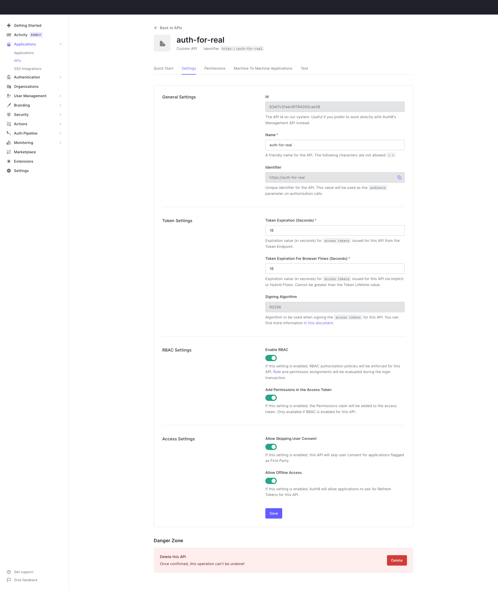
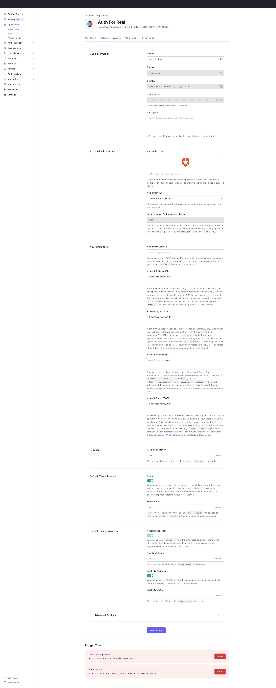

# Example NextJS app to reproduce Auth0-react beta error
`isAuthenticated` continues to be `true` even after refresh token is expired and `useRefreshTokensFallback={false}`.

## Auth0 Setup
Set up an API with super short token expiration:


Set up an application with super short token expiration:


## NextJS Setup
Set these env variables in an `.env` file in the project root:
```
NEXT_PUBLIC_AUTH0_DOMAIN=
NEXT_PUBLIC_AUTH0_CLIENT_ID=
NEXT_PUBLIC_AUTH0_AUDIENCE=
NEXT_PUBLIC_AUTH0_SCOPE='openid profile email offline_access'
```
Then do the following:
- `yarn install`
- `yarn dev`

## Run Experiment

1. Log in (click "Log In" button)
1. Notice user object is set after successful login
1. Wait until the refresh token has expired (should expire based on Auth0 settings in application)
1. Get access token (click "Call API" button)
1. Notice in JavaScript console that the refresh token is invalid
1. Notice that "isAuthenticated = true" continues to be displayed and the top button still shows "Log out" instead of "Sign in"